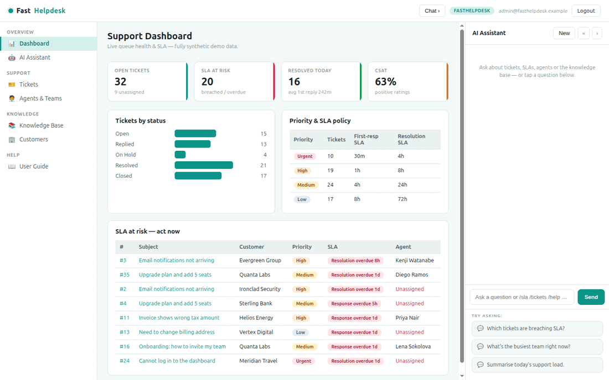

# FastHelpdesk

**FastHelpdesk** is an open-source **customer-support desk** built with
[FastHTML](https://fastht.ml) — a server-side, HTMX-driven port of the core of
[Frappe Helpdesk](https://github.com/frappe/helpdesk). Python-first, no
JavaScript framework: a ticket queue with **live SLA timers**, threaded ticket
conversations, agents & teams, a knowledge base, customers, and an AI assistant
grounded in your live queue.

*Support that keeps its promises.* Runs on port **5007**.

> **Synthetic data only — no PII.** Everything ships and runs on deterministic,
> fully synthetic data generated by `seed.py`.

## Demo



## Quickstart (native)

```bash
python -m venv .venv
.venv/bin/python -m pip install -r requirements.txt
cp .env.sample .env          # optional — add an LLM key for free-form AI chat
.venv/bin/python web_app.py  # http://localhost:5007  (self-seeds on first boot)
```

Login: `admin@fasthelpdesk.example` / `FastHelpdesk2026$` (override in `.env`).
Rebuild demo data: `.venv/bin/python seed.py`.

## Run with Docker

```bash
docker compose up --build      # http://localhost:5007
```

`Dockerfile` (python:3.12-slim, port 5007) seeds on first boot;
`docker-compose.yml` mounts a `fasthelpdesk-data` volume at `/data` so the SQLite
DB survives rebuilds.

## Module tour

- **Dashboard** (`/`) — queue KPIs (open, **SLA at risk**, resolved today, CSAT),
  tickets by status, your priority/SLA policy, and an **"SLA at risk" worklist**.
- **Tickets** (`/tickets`) — filter by status & priority, search, and open any
  ticket for the full **customer conversation**, internal notes, **live SLA
  timers** (due-in / overdue per the priority policy), and an activity log.
- **Agents & Teams** (`/agents`) — workload and availability per agent and team.
- **Knowledge Base** (`/kb`) — published help articles by category.
- **Customers** (`/customers`) — accounts ranked by open tickets.
- **AI Assistant** (right rail) — chat over a **live snapshot** of the queue.
  Plain-English questions stream from a configurable LLM provider; **slash-commands**
  (`/sla`, `/tickets`, `/priority`, `/agents`, `/kb`, `/kpi`, `/help`) resolve
  instantly with **no API key**.

## SLA engine

Each priority (Urgent / High / Medium / Low) has first-response and resolution
targets (`db.SLA_TARGETS`). FastHelpdesk computes each open ticket's live SLA
state against the clock and renders a badge — *Response due in 2h*,
*Resolution overdue 1d* — so the queue surfaces what needs attention first.

## Configuration

`.env` (see `.env.sample`). Free-form AI chat needs one provider:

```ini
MODEL_PROVIDER=xai          # xai | openai | anthropic | google
MODEL_NAME=grok-4-1-fast-reasoning
XAI_API_KEY=...
```

Without a key the whole app still works and slash-commands answer from SQLite.

## Architecture

```
web_app.py        routes, auth, SSE chat endpoint, boot
db.py             SQLite schema + SLA engine + read helpers
seed.py           deterministic synthetic-data generator
web/layout.py     3-pane shell, CSS, chat JS
web/views.py      page renderers
web/ai.py         slash-commands + multi-provider streaming chat
scripts/          build_demo_gif.sh · frappe_doctype_to_schema.py
```

See **[SKILLS.md](SKILLS.md)** for the capability reference + Frappe→FastHTML
migration playbook, and **[docs/ROADMAP.md](docs/ROADMAP.md)** for the feature
comparison against upstream Frappe Helpdesk.

## Licence

MIT. Part of the
[`fasthtml-oss-migrations`](https://github.com/predictivelabsai/fasthtml-oss-migrations)
initiative.
