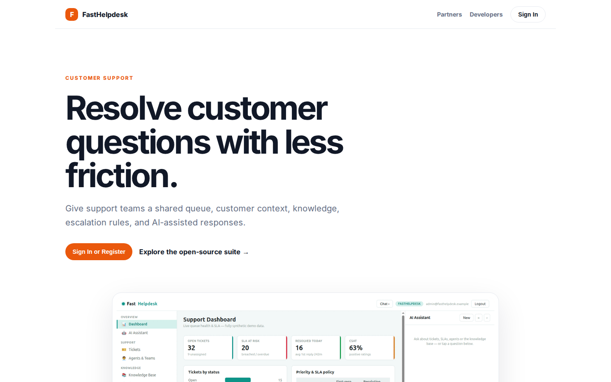
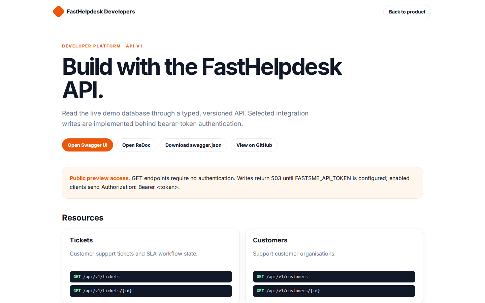
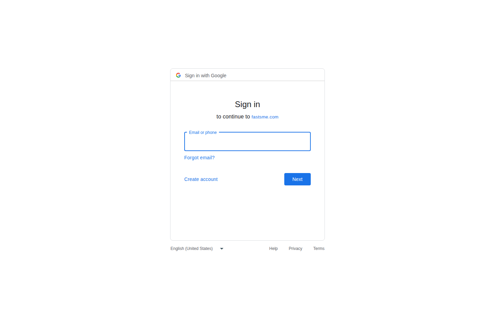

# FastHelpdesk Platform Guide

**Published:** 2026-08-19
**Platform:** [https://helpdesk.fastsme.com](https://helpdesk.fastsme.com)
**Source:** [github.com/predictivelabsai/FastHelpdesk](https://github.com/predictivelabsai/FastHelpdesk)

## Platform overview

**FastHelpdesk** is an open-source **customer-support desk** built with — a server-side, HTMX-driven port of the core of . Python-first, no JavaScript framework: a ticket queue with **live SLA timers**, threaded ticket conversations, agents & teams, a knowledge base, customers, and an AI assistant grounded in your live

This visual guide was reviewed against the live product using Playwright. Screens and available navigation can vary by account, role, and deployment configuration.

## 1. Resolve customer questions with less friction.

CUSTOMER SUPPORT Resolve customer questions with less friction. Give support teams a shared queue, customer context, knowledge, escalation rules, and AI-assisted responses. Sign In or Register Explore the open-source suite → Product tour · see the workspace in

Screen reviewed at: [https://helpdesk.fastsme.com/](https://helpdesk.fastsme.com/)

## 2. Build with the FastHelpdesk API.

FastHelpdesk Developers Back to product DEVELOPER PLATFORM · API V1 Build with the FastHelpdesk API. Read the live demo database through a typed, versioned API. Selected integration writes are implemented behind bearer-token authentication. Open Swagger UI Ope

Screen reviewed at: [https://helpdesk.fastsme.com/developers](https://helpdesk.fastsme.com/developers)

## 3. Sign in

Sign in with Google Sign in to continue to fastsme.com Email or phone Forgot email? Next Create account Afrikaans azərbaycan bosanski català Čeština Cymraeg Dansk Deutsch eesti English (United Kingdom) English (United States) Español (España) Español (Latinoam

Screen reviewed at: [https://accounts.google.com/v3/signin/identifier?opparams=%253F&dsh=S-1575712528%3A1787122773035626&access_type=online&client_id=887059023987-2a7spj1m82eivobdbt1itb3cqca6tpt1.apps.googleusercontent.com&o2v=2&prompt=select_account&redirect_uri=https%3A%2F%2Fhelpdesk.fastsme.com%2Fauth%2Fgoogle%2Fcallback&response_type=code&scope=openid+email+profile&service=lso&state=X92SplIE74-wSc-gitzv5YU1x23ZEu4vIpEaS6XCKg8&flowName=GeneralOAuthLite&continue=https%3A%2F%2Faccounts.google.com%2Fsignin%2Foauth%2Flegacy%2Fconsent%3Fauthuser%3Dunknown%26part%3DAJi8hAOxPBwv4p3-iFG25i1G-_Y-Y0xKxLLR--slxzD9rVzHzW8r4Ew0gYc4qqOvJWe_G5H5uEmUnYUJZOCzMvwY2aHx21ybh3Ry3nu63yIKUlzJCQ-qkm4e10T31ZITD-Zcvltdc7z1YTBEpTtSkfwweZnkpUz86fxPZlfdosotNO2gH3pWjm_3fs7sy9zVZrQqhqMBVkIzroniypLS5cDpc8xE7WsDrNdFFMRlUzBkZABIaIfLDX892xMPI1YUajO6Rh6I6ZUFIbn3qEz1TzBNwYT464pe4UH50OJPTT97MLHrNCa6pP_-CMlNmc3IqEZNhIIoMRIQHqLL_Kvr8uox1ApndJdd9cxd0Vsu-HBJ8hBDzwCPVGSgpxDXS7J8ouBqbpFRLXqJAdUIEZHWC8T6MUqKSzItHofwpu9PCXPIXL-U4cRjDM1g0avc65YuAlNDLaoRPa3a53ONR4HMIjCVCz79GgPJiseoeYGqrA37pFKt3OxyONk%26flowName%3DGeneralOAuthFlow%26as%3DS-1575712528%253A1787122773035626%26client_id%3D887059023987-2a7spj1m82eivobdbt1itb3cqca6tpt1.apps.googleusercontent.com%23&app_domain=https%3A%2F%2Fhelpdesk.fastsme.com&rart=ANgoxcfmYG_iXNthV6Hp4UkmRkc_UZI4laXaCc0Zuca4GEr5dR66cjZoP1Nq1-Ee1zQtmiJJAOpE30V_yaYRDvShbzHaPp_ARxcRBIfDSP-4tnyZHUlrQ7s](https://accounts.google.com/v3/signin/identifier?opparams=%253F&dsh=S-1575712528%3A1787122773035626&access_type=online&client_id=887059023987-2a7spj1m82eivobdbt1itb3cqca6tpt1.apps.googleusercontent.com&o2v=2&prompt=select_account&redirect_uri=https%3A%2F%2Fhelpdesk.fastsme.com%2Fauth%2Fgoogle%2Fcallback&response_type=code&scope=openid+email+profile&service=lso&state=X92SplIE74-wSc-gitzv5YU1x23ZEu4vIpEaS6XCKg8&flowName=GeneralOAuthLite&continue=https%3A%2F%2Faccounts.google.com%2Fsignin%2Foauth%2Flegacy%2Fconsent%3Fauthuser%3Dunknown%26part%3DAJi8hAOxPBwv4p3-iFG25i1G-_Y-Y0xKxLLR--slxzD9rVzHzW8r4Ew0gYc4qqOvJWe_G5H5uEmUnYUJZOCzMvwY2aHx21ybh3Ry3nu63yIKUlzJCQ-qkm4e10T31ZITD-Zcvltdc7z1YTBEpTtSkfwweZnkpUz86fxPZlfdosotNO2gH3pWjm_3fs7sy9zVZrQqhqMBVkIzroniypLS5cDpc8xE7WsDrNdFFMRlUzBkZABIaIfLDX892xMPI1YUajO6Rh6I6ZUFIbn3qEz1TzBNwYT464pe4UH50OJPTT97MLHrNCa6pP_-CMlNmc3IqEZNhIIoMRIQHqLL_Kvr8uox1ApndJdd9cxd0Vsu-HBJ8hBDzwCPVGSgpxDXS7J8ouBqbpFRLXqJAdUIEZHWC8T6MUqKSzItHofwpu9PCXPIXL-U4cRjDM1g0avc65YuAlNDLaoRPa3a53ONR4HMIjCVCz79GgPJiseoeYGqrA37pFKt3OxyONk%26flowName%3DGeneralOAuthFlow%26as%3DS-1575712528%253A1787122773035626%26client_id%3D887059023987-2a7spj1m82eivobdbt1itb3cqca6tpt1.apps.googleusercontent.com%23&app_domain=https%3A%2F%2Fhelpdesk.fastsme.com&rart=ANgoxcfmYG_iXNthV6Hp4UkmRkc_UZI4laXaCc0Zuca4GEr5dR66cjZoP1Nq1-Ee1zQtmiJJAOpE30V_yaYRDvShbzHaPp_ARxcRBIfDSP-4tnyZHUlrQ7s)

## Getting started

Visit [https://helpdesk.fastsme.com](https://helpdesk.fastsme.com) to explore FastHelpdesk. For source code and deployment details, use the GitHub link above.
